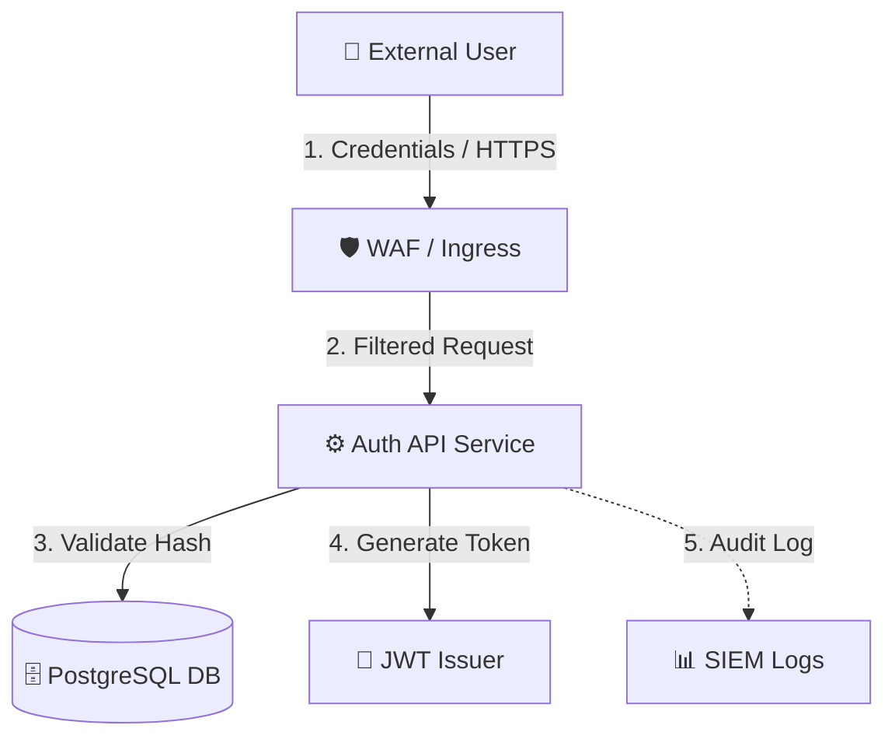

# 🛡️ Application Threat Model Template

> **Instructions**: Use this template to document threat models for new applications, major feature updates, microservices, or architecture changes. Copy this file into your project repository (e.g. `docs/THREAT_MODEL.md`) or security review folder.

---

## 1. System Metadata & Overview

| Attribute | Details |
| :--- | :--- |
| **System Name** | *[e.g., User Authentication Service]* |
| **Version / Sprint** | *[e.g., v2.1.0 / Sprint 42]* |
| **Owner / Lead Engineer** | *[Name / Team Email]* |
| **Security Reviewer** | *[Name / Security Lead]* |
| **Last Updated** | *[YYYY-MM-DD]* |
| **Classification** | *[Public / Internal / Confidential / Restricted]* |

### 1.1 Business Purpose & High-Level Description
*Briefly describe what this system does, who uses it, and its primary business function.*

---

## 2. Scope & Trust Boundaries

### 2.1 Included in Scope
- [x] API Endpoints (`/api/v1/auth`, `/api/v1/users`)
- [x] Database (`PostgreSQL User DB`)
- [x] Third-Party Integrations (`OAuth Provider`, `SendGrid Mail`)

### 2.2 Excluded from Scope & Rationale
- [ ] Corporate Network Infrastructure *(Managed by SecOps under SOC 2)*

---

## 3. Data Flow Diagram (DFD) & Architecture

*Insert your DFD diagram below (Mermaid, PNG, SVG, or ASCII art).*

### 3.1 Key Assets
| Asset ID | Asset Name | Description | Sensitivity |
| :---: | :--- | :--- | :--- |
| **A-01** | User Passwords & Hashes | Argon2id password hashes | `Restricted` |
| **A-02** | Session JWT Keys | Private keys signing session tokens | `Restricted` |
| **A-03** | PII (Email, Phone) | Personal user details | `Confidential` |

### 3.2 Entry Points & External Interfaces
| ID | Interface Name | Description | Protocol / Port | Trust Level |
| :---: | :--- | :--- | :--- | :--- |
| **EP-01** | Public REST API | Public web/mobile endpoint | HTTPS (443) | Untrusted |
| **EP-02** | Admin Console | Internal management portal | HTTPS + MFA | Semi-Trusted |

---

## 4. Threat Identification (STRIDE Analysis)

| Threat ID | Target Element | STRIDE Category | Threat Description | Likelihood | Impact | Risk Level |
| :---: | :--- | :---: | :--- | :---: | :---: | :---: |
| **T-01** | Auth API | **S**poofing | Attacker performs credential stuffing against `/login` | High | High | `CRITICAL` |
| **T-02** | PostgreSQL DB | **T**ampering | SQL Injection via unvalidated search filter parameter | Medium | High | `HIGH` |
| **T-03** | Audit Logs | **R**epudiation | Malicious admin clears login audit logs after abuse | Low | High | `MEDIUM` |
| **T-04** | API Responses | **I**nfo Disclosure | Detailed stack trace returned on HTTP 500 error | High | Low | `MEDIUM` |
| **T-05** | Auth API | **D**enial of Service | CPU exhaustion via unthrottled Argon2 hash computations | High | Medium | `HIGH` |
| **T-06** | JWT Token | **E**levation | Attacker modifies JWT algorithm to `none` or manipulates claims | Medium | High | `HIGH` |

---

## 5. Risk Mitigation & Action Plan

| Threat ID | Mitigation Control | Control Type | Assignee | Target Date | Status |
| :---: | :--- | :---: | :---: | :---: | :---: |
| **T-01** | Enforce IP rate-limiting, CAPTCHA on failure, and MFA | Preventative | `@dev-lead` | `2026-08-15` | `In Progress` |
| **T-02** | Enforce parameterized queries via ORM; strictly validate inputs | Preventative | `@backend` | `2026-08-01` | `Done` |
| **T-03** | Stream logs directly to read-only immutable WORM storage | Detective | `@devops` | `2026-08-20` | `Open` |
| **T-04** | Configure global exception handler to return generic error messages | Corrective | `@backend` | `2026-08-05` | `Done` |
| **T-05** | Implement token-bucket rate limiting (10 req/min per IP) | Preventative | `@devops` | `2026-08-10` | `In Progress` |
| **T-06** | Explicitly enforce `RS256` key verification; reject `none` alg | Preventative | `@backend` | `2026-08-01` | `Done` |

---

## 6. Residual Risk & Sign-Off

### 6.1 Accepted Residual Risks
*List any risks that cannot be fully mitigated and have been accepted by business leadership.*

- **Accepted Risk #1**: IP Rate limiting may be bypassed by distributed botnets. Accepted residual risk with monitoring alert threshold set at 5,000 failed logins/min.

### 6.2 Review & Approval Sign-Off
- [ ] **Engineering Lead**: ____________________ Date: _________
- [ ] **Security Lead**: ________________________ Date: _________
- [ ] **Product Manager**: ____________________ Date: _________
